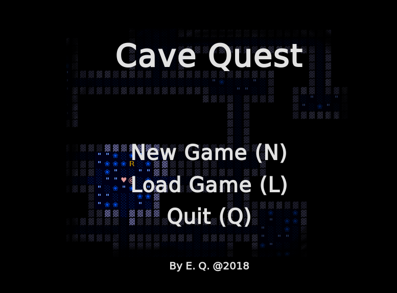
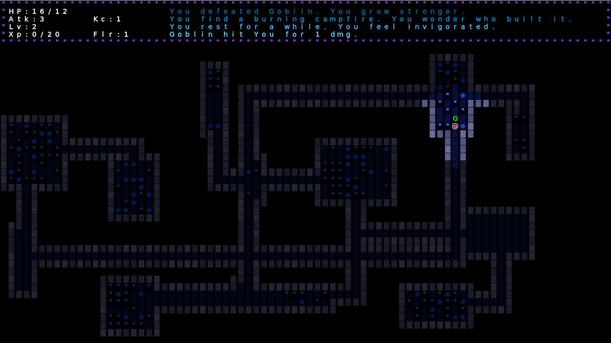
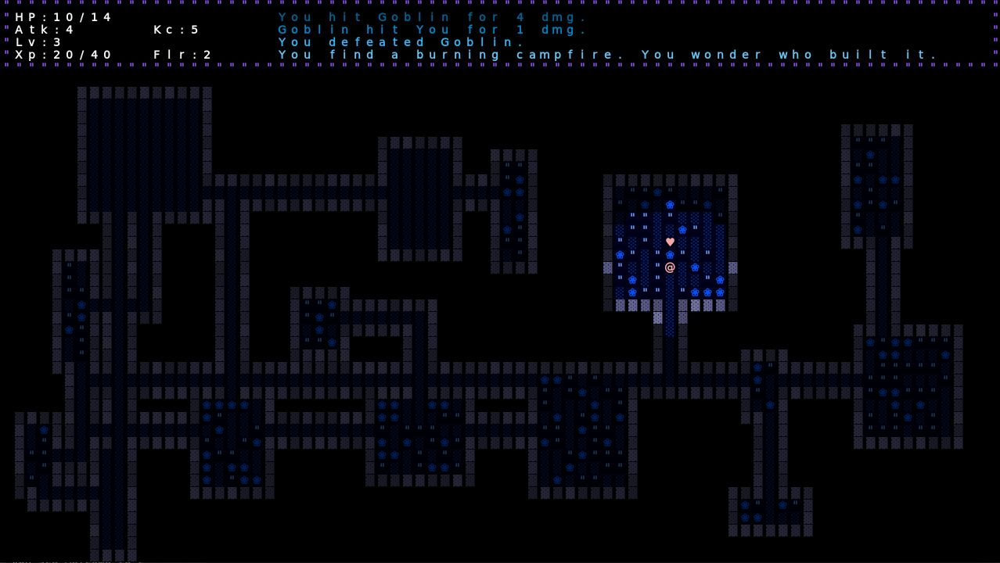
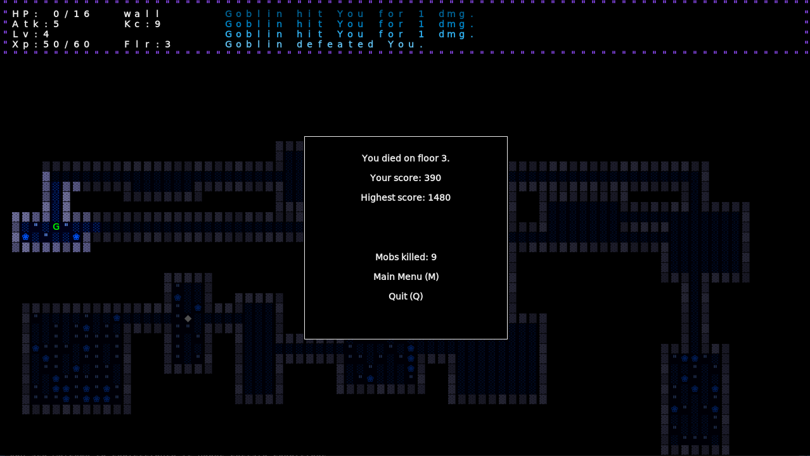

# Introduction
Cave Quest is a 2d dungeon crawler/rogue-like game that keeps a permanent record of the player's progress, which is erased upon death. The player character must fight in turn-based combat rounds against hordes of monsters as they advance deeper into the dungeons. No two playthroughs are the same, as dungeon layouts and monster positions are randomly generated. The ultimate goal is to defeat several boss characters, each of which has a unique mechanic.

# Screenshots

# Running the Game
With IntelliJ, simply clone the [repository](https://github.com/equan06/cave-quest) and import the project with default settings. Go to File > Project Structure > Libraries, and click the green +. Add /libraries/javalib.

To run the game, simply compile and run Main.java.

# Controls

* WASD controls movement
* Q+; saves and quits the game
* ` toggles developer mode

# Updates/Issues

This project has not been updated since May 2018. Some TO-DOs:
 * restructure the main game engine files
 * general game content development

# Acknowledgements

This was a class project for Sp18 CS61B, and relies on the Princeton StdDraw Libraries. This game was heavily inspired by the rogue-like [Brogue](https://sites.google.com/site/broguegame/) by Brian Walker.
